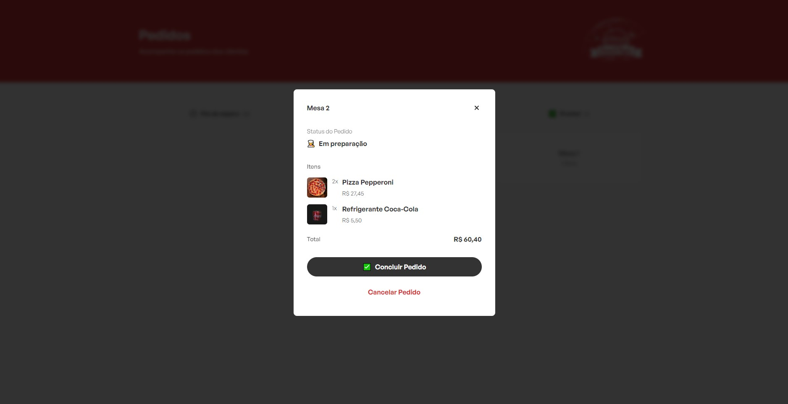

# SnackByte - Lanche e NET

## Descrição

Este é um conjunto de softwares desenvolvidos para modernizar o processo de pedidos em lanchonetes.
Com o aplicativo móvel, os garçons podem registrar os pedidos dos clientes de forma rápida e eficiente.
Enquanto isso, a equipe na cozinha pode acompanhar os pedidos em tempo real através de um navegador web.

## Tecnologias Utilizadas

- Backend: - [NodeJS](https://nodejs.org/) | [MongoDB](https://www.mongodb.com/pt-br)
- Frontend (Web): [ReactJS](https://react.dev)
- Frontend (Mobile): [React Native](https://reactnative.dev)
- WebSocket: [Socket.io](https://socket.io)

## Screenshots

### Mobile

  
  
  

  
### Web

## Repositórios

- [Backend](https://github.com/moraiskaua/back-end-SnackByte)
- [Frontend](https://github.com/moraiskaua/front-end-SnackByte)
